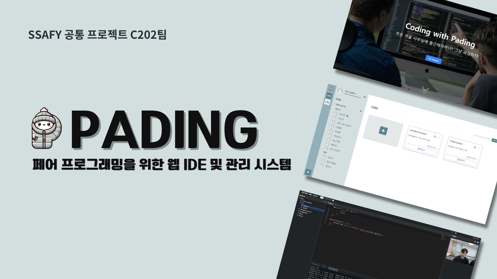
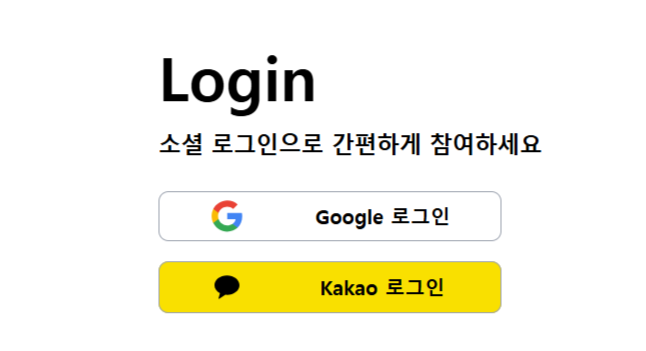
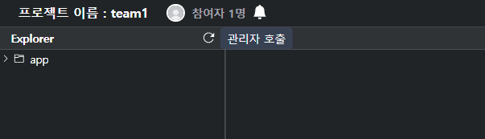
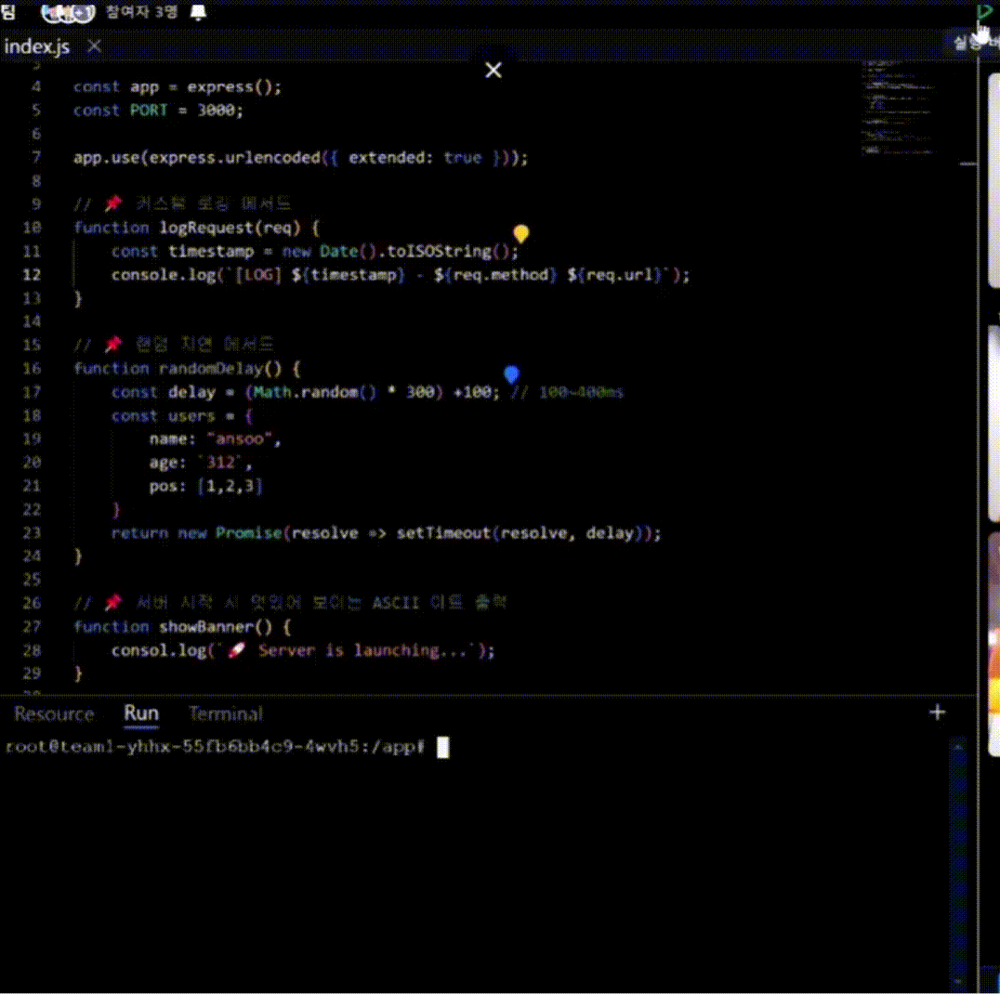
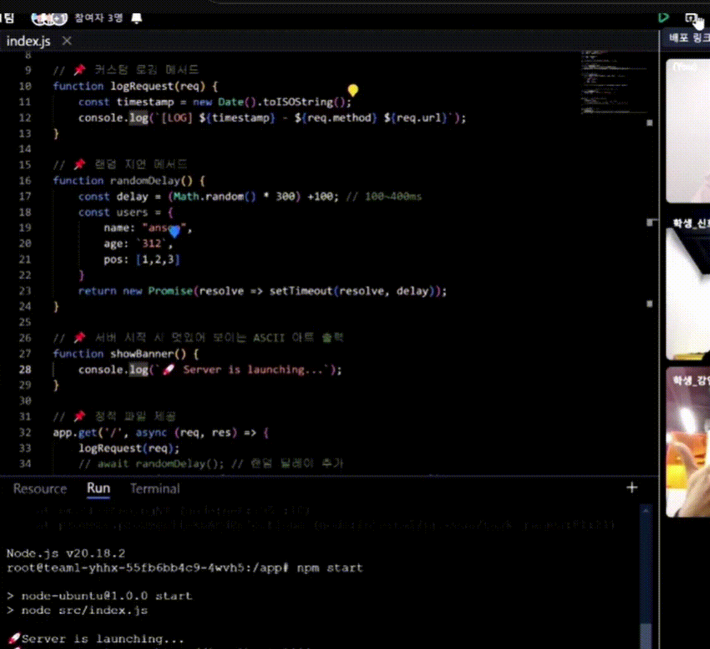
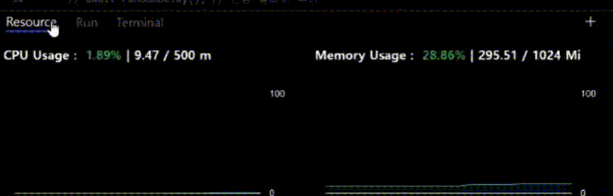

 

> C202 Pading 공통 PJT 우수상/ 웹기술 Track 
> 2025.01.06 ~ 2024.02.21 (7주) 
> 🔗 **[Paing](https://pair-coding.site/) 바로가기 **

### 📌 Contents
- [Overview](#overview)
- [기능 소개](#기능-소개)
  - [✔ 메인 페이지](#-메인페이지)
  - [✔ 매니징 시스템](#-매니징-시스템)
  - [✔ 공동 편집 IDE](#-공동-편집-ide)
- [기술 스택](#기술-스택)
  - [✔ 프론트엔드 기술 스택](#프론트엔드-기술-스택)
- [주요 기술](#주요-기술)
- [시스템 아키텍처](#시스템-아키텍처)
- [산출물](#산출물)
- [팀원 소개](#팀원-소개)
    - [🔥 Pading](#-pading)

## Overview
🗣 기존의 페어 프로그래밍 방식, 너무 불편하지 않나요?
한 명이 코딩하고, 다른 한 명이 지켜보는 방식은 비효율적일 때가 많죠.

💻 각자의 컴퓨터에서 동시에 코딩하며 실시간 공동 편집!
🚀 코드 수정 즉시 반영! 자동 배포로 더 빠르게!
🤝 원격 환경에서도 원활한 협업, 생산성 극대화!

페어 프로그래밍을 더 편리하고 효율적으로!
이제 **PADING**과 함께 새로운 개발 경험을 시작하세요! 🚀

## 기능 소개

### ✔ 메인페이지
#### 사이트 소개
  

#### 로그인
- 구글과 카카오톡으로 소셜 로그인 지원

  

### ✔ 매니징 시스템

- **매니징 시스템**: 오너, 매니저, 멤버로 구성
- **그룹 및 프로젝트 관리**

#### 그룹 페이지(Home)
- 로그인을 하면 자신이 속한 그룹 페이지로 이동
- 그룹의 정보와 프로젝트 등을 확인할 수 있음

  

#### 그룹 네비게이션
- 자신이 속한 그룹의 리스트를 보여줌
- 하단에 그룹을 생성하거나 참여할 수 있는 버튼(+)
- 현재 선택된 그룹의 정보(참여중인 인원, 접속중인 인원, 그룹의 이름 등등)를 확인할 수 있음

  

#### 그룹 생성
- 그룹 이름과 인원제한을 설정할 수 있음
- 그룹 이름의 경우 중복될 수 없음

  

#### 그룹 초대와 참여
- 그룹에 속해있는 매니저는 초대링크를 생성할 수 있음
- 그룹 참여는 직접 url로 들어가는 방법과 그룹참여하기 모달, 2가지 방법이 있음

  

  

#### 그룹 이름 변경 및 그룹 삭제
- 오너의 경우 그룹의 이름을 변경, 그룹 삭제를 할 수 있음

 
  

#### 멤버 권한 변경 및 제외
- 매니저는 일반멤버를 그룹에서 제외할 수 있음
- 오너는 매니저와 일반멤버를 그룹에서 제외할 수 있음
- 오너는 멤버들의 권한을 변경할 수 있음

  

#### 오너 위임
- 오너는 다른 멤버에게 오너를 위임할 수 있음
- 위임 후에는 매니저로 권한이 변경됨

- 프로젝트를 생성, 삭제, 상태 관리를 할 수 있음

#### 프로젝트 리스트
- 현재 접속중인 인원들과 내가 속해있는 프로젝트를 볼 수 있음
- 그룹의 매니저의 경우 모든 프로젝트를 볼 수 있음

  

#### 프로젝트 생성
- 매니저는 프로젝트를 생성할 수 있음
- 프로젝트 이름, 언어, OS, 성능, 구성원 등을 선택할 수 있음
- OS의 경우 언어마다 지원하는 OS가 다르기 때문에 언어를 먼저 선택
- 생성의 경우 시간이 걸리기 때문에 로딩표시로 진행중이라는 것을 보여줌

  

#### 프로젝트 삭제
- 매니저는 프로젝트를 삭제할 수 있음
- 삭제의 경우 시간이 걸리기 때문에 로딩표시로 진행중이라는 것을 보여줌

#### 프로젝트 상태
- 현재 프로젝트의 상태 정보를 확인할 수 있음(On / Off, 입장 인원 등등)
- 누군가가 프로젝트에 입장했을 때 프로젝트 상태가 자동으로 On으로 변경됨
- 프로젝트에 입장해 있는 인원이 없을 경우, 프로젝트 상태를 Off로 변경할 수 있음

  

#### 매니저 호출
- 프로젝트 페이지에서 사용자가 매니저 호출 버튼을 누르면, 바깥에서 붉은 점으로 표시됨

 
  

### ✔ 공동 편집 IDE

- **에디터**: 
  - **Monaco Editor** + **Yjs**를 활용하여 실시간 공동 편집 구현
  - WebSocket 기반 시그널링 서버를 구축하여 다중 사용자 동기화
- **터미널**:
  - **Xterm.js**를 사용하여 터미널 환경 구현
  - **STOMP.js** 및 **SockJS**를 활용하여 각 프로젝트 컨테이너와 실시간 통신

#### 프로젝트 페이지
- 프로젝트에서 파일을 작성하고, 협업을 할 수 있는 페이지

#### 채팅
- 프로젝트에 인원들과 실시간으로 채팅

  

#### 화상회의
- 참여하기 전 마이크와 비디오를 체크할 수 있음
- 화상회의 부분은 슬라이더로 다른 사용자를 확인
- 해당 섹션의 크기를 늘릴 수 있음

  

#### 파일 탐색기
- 해당 프로젝트에 있는 파일을 확인할 수 있음
- 파일을 클릭하여 열 수 있음
- 삭제, 생성 등을 할 수 있음

  

#### 파일 편집기
- 연 파일을 수정할 수 있음
- 다른사람과 동시에 수정할 수 있음
- 다른사람이 편집하는 부분은 색깔이 다른 커서로 표시되어있음

  

#### 실행
- 버튼을 눌러 해당 프로젝트를 실행할 수 있음
- 실행에 실패할 경우 실패한 원인도 콘솔에 띄워줌

  

#### 배포
- 실행되고 있는 프로젝트는 자동으로 배포됨
- 버튼을 눌러 배포된 화면을 볼 수 있음

  

#### AI 코드리뷰
- 현재 열려있는 파일을 AI코드리뷰를 받을 수 있음
- 코드를 바로 복사할 수 있도록 코드블록 지원

  

#### 리소스 모니터링
- 현재 사용중인 리소르를 확인할 수 있음
- 탭을 열지 않아도 왼쪽 아래에 간략하게 보여줌
- 특정 수치가 넘어가면 색상이 빨간색으로 변경됨

  

## 기술 스택
 

### ✔ 프론트엔드 기술 스택
- **TypeScript + React** 기반
- **Tailwind CSS**를 활용한 UI 스타일링
- **Vite**를 빌드 툴로 사용하여 빠른 개발 환경 구축

## 주요 기술
- **데이터 파이프라인 구축**
  - 각 데이터베이스의 특성을 고려한 멀티 데이터베이스 아키텍처 설계 
  - 대용량 데이터 백업을 위한 효율적인 아키텍처 설계 
  - APScheduler를 활용한 데이터 수집 프로세스 자동화 
  
  
- **하이브리드 추천 시스템**
  - **Cold Start 문제 해결**을 위한 협업 필터링(CF) 및 컨텐츠 기반 필터링(CBF) 결합 
  - 사용자 행동 데이터 기반 유사도 계산 
  - KoNLPy 기반 형태소 분석 및 TF-IDF 매트릭스 구축 
  

- **Elasticsearch 기반 검색**
  - 뉴스 기사 검색 기능 최적화 
  - 역 인덱스 활용한 데이터 처리 및 검색 기능 제공 
  

## 시스템 아키텍처
- **Blue/Green 무중단 배포 전략**
  - 애플리케이션의 두 개의 환경(Blue와 Green)을 활용하여 서비스의 가용성과 안정성을 높이는 배포 방식 
   

## 산출물
| 종류 | 바로가기 |
| --- | --- |
| API 명세서 | [📡 API 명세서](https://aback-mandolin-01e.notion.site/API-96e24c73ae4f43ff8ce1cdf464d804f7) |
| 와이어 프레임 | [🎨 와이어 프레임](https://www.figma.com/design/dgzYzuJbAeYHOXEp3LYs8M/%ED%99%94%EB%A9%B4-%EC%84%A4%EA%B3%84?node-id=0-1&p=f&t=HkpWcjM3jrOzOSsT-0) |
| E-R Diagram | [🖥️ E-R Diagram](https://www.erdcloud.com/d/Q75Bv3GSFP2C6mu8F) 
| 최종 발표 자료 | [📊 최종 발표 자료](./docs/C202_공통프로젝트_발표.pdf) | |

## 팀원 소개
#### 🔥 Pading

|**[👑허인주/BE](https://github.com/jjonior)**|**[박재형/BE](https://github.com/arnold714)**|**[강안수/FE](https://github.com/kangansoo)**|**[신희원/FE](https://github.com/heewon0107)**|**[이준익/FE](https://github.com/juniqu-e)**|**[강신우/FE](https://github.com/sinukang)** |
| :---------------------------------------------------------------------------------------------------------------------------: | :---------------------------------------------------------------------------------------------------------------------------: | :---------------------------------------------------------------------------------------------------------------------------: | :---------------------------------------------------------------------------------------------------------------------------: | :---------------------------------------------------------------------------------------------------------------------------: | :---------------------------------------------------------------------------------------------------------------------------: |
|  |  |  |  |  |  |

