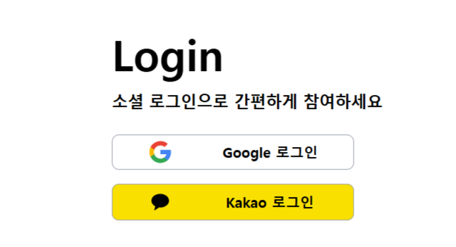
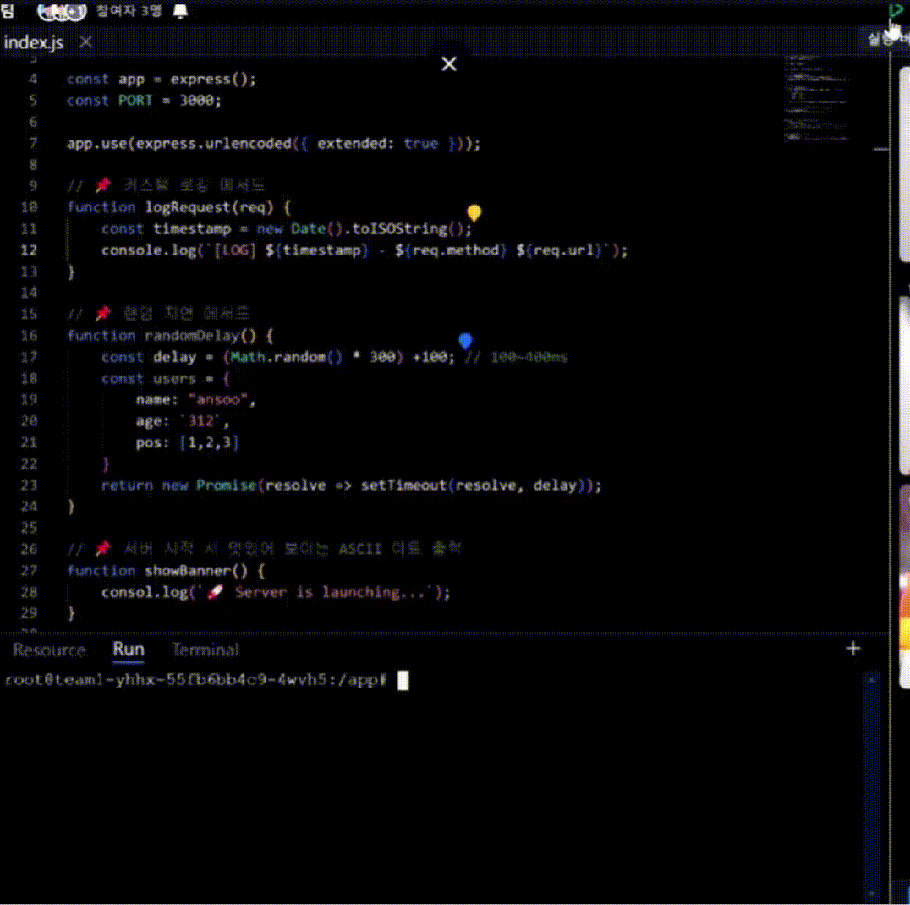
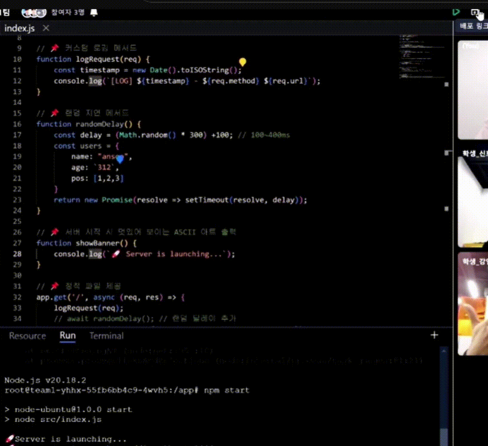

## 기능 소개

### ✔ 로그인
- 구글과 카카오톡으로 소셜 로그인

  

### ✔ 사이트 소개 페이지
- 사이트를 간단하게 소개

  

### ✔ 그룹 페이지 (HOME)
- 로그인을 하면 자신이 속한 그룹 페이지로 이동
- 그룹의 정보와 프로젝트 등을 확인할 수 있음

  

#### 그룹 네비게이션
- 자신이 속한 그룹의 리스트를 보여줌
- 하단에 그룹을 생성하거나 참여할 수 있는 버튼(+)
- 현재 선택된 그룹의 정보(참여중인 인원, 접속중인 인원, 그룹의 이름 등등)를 확인할 수 있음

  

#### 그룹 생성
- 그룹 이름과 인원제한을 설정할 수 있음
- 그룹 이름의 경우 중복될 수 없음

  

#### 그룹 초대와 참여
- 그룹에 속해있는 매니저는 초대링크를 생성할 수 있음
- 그룹 참여는 직접 url로 들어가는 방법과 그룹참여하기 모달, 2가지 방법이 있음

  

  

#### 그룹 이름 변경 및 그룹 삭제
- 오너의 경우 그룹의 이름을 변경, 그룹 삭제를 할 수 있음

  
  

#### 멤버 권한 변경 및 제외
- 매니저는 일반멤버를 그룹에서 제외할 수 있음
- 오너는 매니저와 일반멤버를 그룹에서 제외할 수 있음
- 오너는 멤버들의 권한을 변경할 수 있음

  

#### 오너 위임
- 오너는 다른 멤버에게 오너를 위임할 수 있음
- 위임 후에는 매니저로 권한이 변경됨

### ✔ 프로젝트(IDE X)
- 프로젝트를 생성, 삭제, 상태 관리를 할 수 있음

#### 프로젝트 리스트
- 현재 접속중인 인원들과 내가 속해있는 프로젝트를 볼 수 있음
- 그룹의 매니저의 경우 모든 프로젝트를 볼 수 있음

  

#### 프로젝트 생성
- 매니저는 프로젝트를 생성할 수 있음
- 프로젝트 이름, 언어, OS, 성능, 구성원 등을 선택할 수 있음
- OS의 경우 언어마다 지원하는 OS가 다르기 때문에 언어를 먼저 선택
- 생성의 경우 시간이 걸리기 때문에 로딩표시로 진행중이라는 것을 보여줌

  

#### 프로젝트 삭제
- 매니저는 프로젝트를 삭제할 수 있음
- 삭제의 경우 시간이 걸리기 때문에 로딩표시로 진행중이라는 것을 보여줌

#### 프로젝트 상태
- 현재 프로젝트의 상태 정보를 확인할 수 있음(On / Off, 입장 인원 등등)
- 누군가가 프로젝트에 입장했을 때 프로젝트 상태가 자동으로 On으로 변경됨
- 프로젝트에 입장해 있는 인원이 없을 경우, 프로젝트 상태를 Off로 변경할 수 있음

  

### ✔ 프로젝트 페이지
- 프로젝트에서 파일을 작성하고, 협업을 할 수 있는 페이지

#### 채팅
- 프로젝트에 인원들과 실시간으로 채팅

  

#### 화상회의
- 참여하기 전 마이크와 비디오를 체크할 수 있음
- 화상회의 부분은 슬라이더로 다른 사용자를 확인
- 해당 섹션의 크기를 늘릴 수 있음

  

#### 파일 탐색기
- 해당 프로젝트에 있는 파일을 확인할 수 있음
- 파일을 클릭하여 열 수 있음
- 삭제, 생성 등을 할 수 있음

  

#### 파일 편집기
- 연 파일을 수정할 수 있음
- 다른사람과 동시에 수정할 수 있음
- 다른사람이 편집하는 부분은 색깔이 다른 커서로 표시되어있음

  

#### 실행
- 버튼을 눌러 해당 프로젝트를 실행할 수 있음
- 실행에 실패할 경우 실패한 원인도 콘솔에 띄워줌

  

#### 배포
- 실행되고 있는 프로젝트는 자동으로 배포됨
- 버튼을 눌러 배포된 화면을 볼 수 있음

  

#### AI 코드리뷰
- 현재 열려있는 파일을 AI코드리뷰를 받을 수 있음
- 코드를 바로 복사할 수 있도록 코드블록 지원

  

#### 리소스 모니터링
- 현재 사용중인 리소르를 확인할 수 있음
- 탭을 열지 않아도 왼쪽 아래에 간략하게 보여줌
- 특정 수치가 넘어가면 색상이 빨간색으로 변경됨

  
