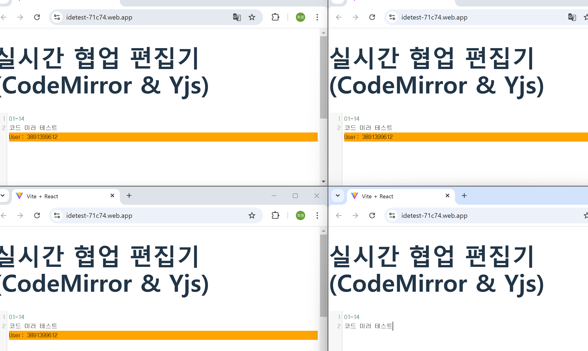

# 학습 기록
## 목차
1. [1일차 01-13 학습 목표](#1일차-01-13-학습-목표)
2. [2일차 01-14 학습 목표](#2일차-01-14-학습-목표)
## 기술 스택
1. React
2. Typescript
3. Talewind
4. WebRTC

## 1일차 학습 01-13


### 목표 
- React를 사용하여 사용자 인터페이스(UI)를 구현합니다.
- Redux를 사용하여 애플리케이션의 상태를 전역적으로 관리합니다.
- 사용자가 Create, Read, Update, Delete 작업을 할 수 있도록 합니다.

## 2일차 학습 01-14

### 목표
WebRTC를 사용한 협업 툴 생성

#### 코드 미러 라이브러리 사용
```javascript
import React, { useEffect } from 'react';
import * as Y from 'yjs';
import { CodemirrorBinding } from 'y-codemirror';
import { WebrtcProvider } from 'y-webrtc';
import CodeMirror from 'codemirror';
import 'codemirror/lib/codemirror.css';
import 'codemirror/mode/javascript/javascript'; // JavaScript 모드 불러오기


function App() {
  useEffect(() => {
    // Yjs 문서와 관련된 설정
    const ydoc = new Y.Doc();
    const provider = new WebrtcProvider('codemirror-demo-room', ydoc); // 'codemirror-demo-room' 이름의 방으로 연결
    const yText = ydoc.getText('codemirror'); // 공유할 텍스트 객체
    const yUndoManager = new Y.UndoManager(yText); // Undo/Redo 관리

    // CodeMirror 편집기 설정
    const editorDiv = document.getElementById('editor'); // HTML 요소에 CodeMirror를 붙일 div를 지정
    const editor = CodeMirror(editorDiv, {
      mode: 'javascript',
      lineNumbers: true,
      value: '// 여기에 코드를 작성하세요.\n', // 초기 코드
    });

    // Yjs와 CodeMirror 바인딩
    const binding = new CodemirrorBinding(yText, editor, provider.awareness, { yUndoManager });

    // 컴포넌트가 언마운트될 때 클린업
    return () => {
      provider.destroy();
      ydoc.destroy();
    };
  }, []); // 빈 배열을 넣어 컴포넌트가 처음 마운트될 때만 실행되도록 설정

  return (
    <div>
      <h1>실시간 협업 편집기 (CodeMirror & Yjs)</h1>
      {/* CodeMirror가 표시될 입력창 */}
      <div id="editor" style={{ height: '400px' }}>
        {editorRef.current}
      </div>
    </div>
  );
}

export default App;
```

### 결과


### 고찰
한 기기에서는 페어프로그램이 되지만 배포 후 다른 기기에서 되질 않는다.

### 내일 목표
WebRTC와 WebSocket의 정리를 하고 각 기기에서 연동이 되도록 해야겠다.
목차 만들기기

